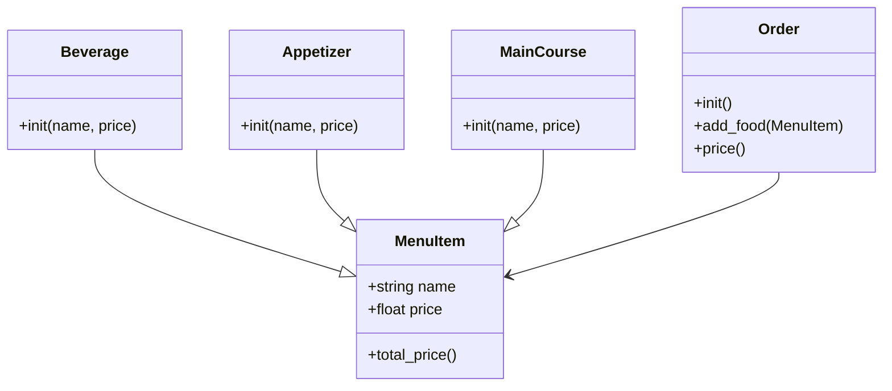

# Reto-POO-No.3

```mermaid
classDiagram
    class MenuItem {
        +string name
        +float price
        +total_price()
    }

    class Beverage {
        +init(name, price)
    }

    class Appetizer {
        +init(name, price)
    }

    class MainCourse {
        +init(name, price)
    }

    class Order {
        +init()
        +add_food(MenuItem)
        +price()
    }

    Beverage --|> MenuItem
    Appetizer --|> MenuItem
    MainCourse --|> MenuItem
    Order --> MenuItem
```
